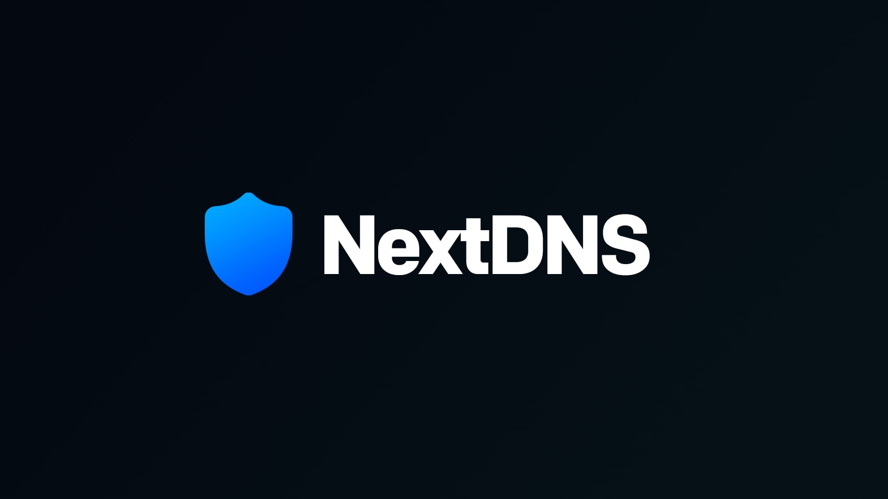

# nextdns-skills



Comprehensive collection of AI agent skills for NextDNS API integration, CLI operations, and DNS
management.

---

## 🚀 Installation & Usage

### ⚙️ Installation

```bash
npx add-skill tuanductran/nextdns-skills
```

### 💡 Usage

For the most reliable results, prefix your prompts with:

```text
use nextdns skill, <your request here>
```

---

## 🧠 Available Skills

| Category                                         | Rules  | Focus                                                                  |
| :----------------------------------------------- | :----: | :--------------------------------------------------------------------- |
| [**NextDNS API**](skills/nextdns-api/SKILL.md)   | **17** | Authentication, Profile management, Analytics, and Logs.               |
| [**NextDNS CLI**](skills/nextdns-cli/SKILL.md)   | **14** | Installation, system-wide configuration, and client monitoring.        |
| [**NextDNS Web UI**](skills/nextdns-ui/SKILL.md) | **12** | Strategic configuration, content filtering, and security modeling.     |
| [**Integrations**](skills/integrations/SKILL.md) | **13** | Third-party platform connectivity (OpenWrt, pfSense, Tailscale, etc.). |

---

## 📜 System Architecture

Rules are categorized into two types to guide AI precision:

- **Capability Rules**: Essential domain knowledge (API protocols, mandatory headers, specific
  command syntax).
- **Efficiency Rules**: Best practices and optimizations to ensure high-quality, consistent
  solutions.

---

## 🛠️ Development

This repository is governed by the **10-Point Protocol System** to ensure high-fidelity skills for
AI agents.

### Quick Commands

| Task                     | Command            |
| :----------------------- | :----------------- |
| **Setup**                | `pnpm install`     |
| **Auto-Format Code**     | `pnpm run format`  |
| **Full Quality Check**   | `pnpm lint`        |
| **Fix Formatting/Terms** | `pnpm lint:fix`    |
| **Check Rule Logic**     | `pnpm lint:rules`  |
| **Check Syntax**         | `pnpm lint:syntax` |
| **Check Broken Links**   | `pnpm lint:links`  |

### Adding New Rules

1. Use the [Rule Template](templates/rule-template.md).
2. Register the rule in the parent `SKILL.md`.
3. Follow the strict requirements in [**CLAUDE.md**](CLAUDE.md).

---

## 🔗 Resources

- [**NextDNS API Documentation**](https://nextdns.github.io/api/)
- [**NextDNS CLI Wiki**](https://github.com/nextdns/nextdns/wiki)
- [**NextDNS Help Center**](https://help.nextdns.io)
- [**NextDNS-Config Guidelines**](https://github.com/yokoffing/NextDNS-Config)

---

## License

MIT
