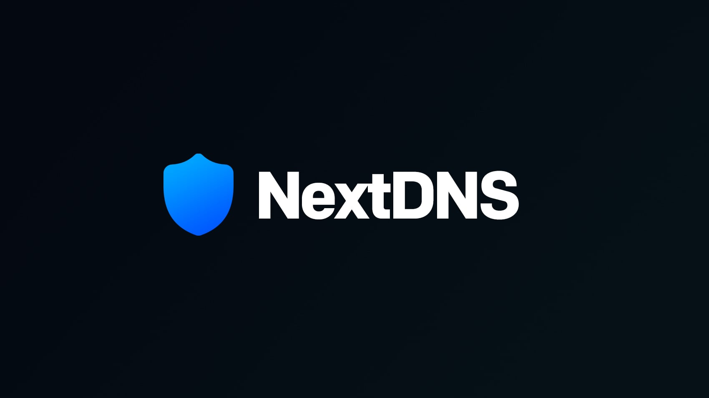

# NextDNS Skills



Comprehensive collection of AI agent skills for NextDNS API integration, CLI operations, and DNS
management.

---

## 🚀 Installation and usage

### ⚙️ Installation

```bash
pnpm dlx skills add tuanductran/nextdns-skills
```

### 💡 Usage

For the most reliable results, prefix your prompts with:

```text
use nextdns skill, <your request here>
```

---

## 🧠 Available skills

| Category                                                 | Rules  | Focus                                                                            |
| :------------------------------------------------------- | :----: | :------------------------------------------------------------------------------- |
| [**NextDNS API**](skills/nextdns-api/SKILL.md)           | **23** | Authentication, Profile management, Analytics, and Logs.                         |
| [**NextDNS CLI**](skills/nextdns-cli/SKILL.md)           | **24** | Installation, system-wide configuration, and client monitoring.                  |
| [**NextDNS Web UI**](skills/nextdns-ui/SKILL.md)         | **16** | Strategic configuration, content filtering, and security modeling.               |
| [**Integrations**](skills/integrations/SKILL.md)         | **20** | Third-party platform connectivity (OpenWrt, pfSense, Tailscale, and more).       |
| [**NextDNS Frontend**](skills/nextdns-frontend/SKILL.md) | **35** | Nuxt, Next.js, Astro, SvelteKit, and React Router: BFF proxy, profile UI, SSE logs, analytics. |

---

## 📜 System architecture

Rules are categorized into two types to guide AI precision:

- **Capability Rules**: Essential domain knowledge (API protocols, mandatory headers, specific
  command syntax).
- **Efficiency Rules**: Best practices and optimizations to ensure high-quality, consistent
  solutions.

---

## 🛠️ Development

This repository is governed by the **10-Point Protocol System** to ensure high-fidelity skills for
AI agents.

### Quick commands

| Task                          | Command                          |
| :---------------------------- | :------------------------------- |
| **Setup**                     | `pnpm install`                   |
| **Auto-Format Code**          | `pnpm run format`                |
| **TypeScript Type Check**     | `pnpm types:check`               |
| **Full Quality Check**        | `pnpm lint`                      |
| **Fix Issues (incl. TS)**     | `pnpm lint:fix`                  |
| **Check Rule Logic**          | `pnpm lint:rules`                |
| **Check Syntax**              | `pnpm lint:syntax`               |
| **Check Broken Links**        | `pnpm lint:links`                |
| **Check Duplicate Titles**    | `pnpm check-duplicates`          |
| **Check Tag Hygiene**         | `pnpm check-tags`                |
| **Quality Checks (all)**      | `pnpm lint:quality`              |
| **Build All Skills**          | `pnpm build:skills`              |
| **Sync Rule Counts**          | `pnpm update-counts`             |
| **Statistics Report**         | `pnpm stats`                     |
| **Search Rules**              | `pnpm rule-search -- --query=<text>` |
| **Export Rules (JSON/CSV)**   | `pnpm rule-export -- --format=csv`   |
| **Run Tests**                 | `pnpm test`                          |
| **Run Tests (coverage)**      | `pnpm test:coverage`                 |

### Adding new rules

1. Use the [Rule Template](templates/rule-template.md).
2. Register the rule in the parent `SKILL.md`.
3. Follow the strict requirements in **[AGENTS.md](AGENTS.md)**.

---

## 🔗 Resources

- [**NextDNS API Documentation**](https://nextdns.github.io/api/)
- [**NextDNS CLI Wiki**](https://github.com/nextdns/nextdns/wiki)
- [**NextDNS Help Center**](https://help.nextdns.io)
- [**NextDNS-Config Guidelines**](https://github.com/yokoffing/NextDNS-Config)

---

## License

MIT
