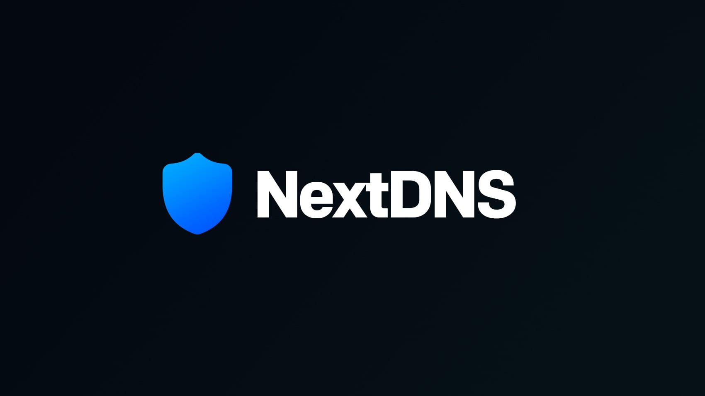

# NextDNS Skills



Comprehensive collection of AI agent skills for NextDNS API integration, CLI operations, and DNS
management.

[](https://skills.sh/tuanductran/nextdns-skills)

---

## Installation and usage

### Installation

```bash
pnpm dlx skills add tuanductran/nextdns-skills
```

### Usage

For the most reliable results, prefix your prompts with:

```text
use nextdns skill, <your request here>
```

### Agent workflows

Repository-specific procedures for adding rules, researching NextDNS behavior, reviewing changes,
and preparing commits live in [.agents/workflows/](.agents/workflows/). These Markdown files are
reusable instructions for coding agents; they are not automatically executed GitHub Actions.

## Documentation and project policies

| Topic | Document |
| :--- | :--- |
| Project documentation index | [docs/README.md](docs/README.md) |
| Project roadmap | [docs/ROADMAP.md](docs/ROADMAP.md) |
| Architecture and source boundaries | [docs/ARCHITECTURE.md](docs/ARCHITECTURE.md) |
| Contribution workflow | [CONTRIBUTING.md](CONTRIBUTING.md) |
| Documentation standards | [docs/DOCUMENTATION.md](docs/DOCUMENTATION.md) |
| Security policy | [SECURITY.md](SECURITY.md) |
| Code of conduct | [CODE_OF_CONDUCT.md](CODE_OF_CONDUCT.md) |
| Change history | [CHANGELOG.md](CHANGELOG.md) |

---

## Available skills

| Category | Rules | Focus |
| :------------------------------------------------------- | :----: | :------------------------------------------------------------------------------- |
| [**NextDNS API**](skills/nextdns-api/SKILL.md) | **23** | Authentication, profile management, analytics, and logs. |
| [**NextDNS CLI**](skills/nextdns-cli/SKILL.md) | **24** | Installation, system-wide configuration, and client monitoring. |
| [**NextDNS Web UI**](skills/nextdns-ui/SKILL.md) | **16** | Strategic configuration, content filtering, and security modeling. |
| [**Integrations**](skills/integrations/SKILL.md) | **21** | Third-party platform connectivity and NextDNS transport selection. |
| [**NextDNS Frontend**](skills/nextdns-frontend/SKILL.md) | **35** | Nuxt 4, Next.js 16, Astro, SvelteKit, and React Router v8: BFF proxy, profile UI, SSE logs, analytics. |

---

## System architecture

Rules are categorized into two types to guide AI precision:

- **Capability rules**: Essential domain knowledge — API protocols, mandatory headers, specific
  command syntax.
- **Efficiency rules**: Best practices and optimizations to ensure high-quality, consistent
  solutions.

---

## Development

### Quick commands

| Task | Command |
| :---------------------------- | :--------------------------------------- |
| **Setup** | `pnpm install` |
| **Format code** | `pnpm run format` |
| **Type check** | `pnpm run types:check` |
| **Full lint** | `pnpm run lint` |
| **Fix all** | `pnpm run lint:fix` |
| **Check rule logic** | `pnpm run lint:rules` |
| **Check syntax** | `pnpm run lint:syntax` |
| **Check broken links** | `pnpm run lint:links` |
| **Check duplicate titles** | `pnpm check-duplicates` |
| **Check tag hygiene** | `pnpm check-tags` |
| **Build all skills** | `pnpm build:skills` |
| **Sync rule counts** | `pnpm update-counts` |
| **Statistics report** | `pnpm stats` |
| **Search rules** | `pnpm rule-search -- --query=<text>` |
| **Export rules (JSON/CSV)** | `pnpm rule-export -- --format=csv` |
| **Run tests** | `pnpm test` |
| **Run tests with coverage** | `pnpm test:coverage` |

### Adding new rules

1. Use the [rule template](templates/rule-template.md).
2. Register the rule in the parent `SKILL.md` in the same commit.
3. Follow the requirements in [AGENTS.md](AGENTS.md).

---

## Resources

- [NextDNS API documentation](https://nextdns.github.io/api/)
- [NextDNS CLI wiki](https://github.com/nextdns/nextdns/wiki)
- [NextDNS Help Center](https://help.nextdns.io)
- [NextDNS-Config guidelines](https://github.com/yokoffing/NextDNS-Config)

---

## License

MIT License © 2026–Present Tuan Duc Tran
