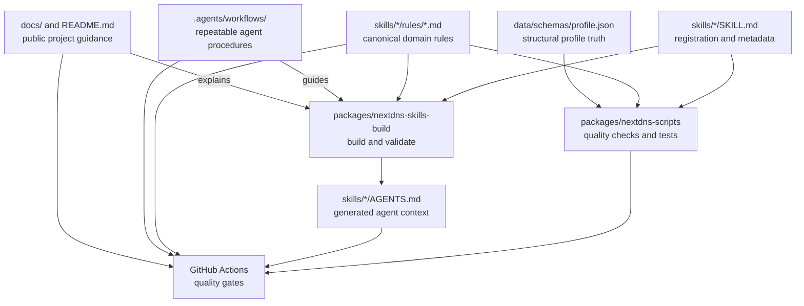

# Architecture

NextDNS Skills is a monorepo that turns structured Markdown rules into agent-consumable context. The repository separates human-facing project documentation, agent context, domain source rules, generated output, validation tooling, and profile schemas. This separation keeps edits reviewable and prevents a generated file from becoming an accidental source of truth.

## Source-of-truth boundary

The most important architecture rule is that source rules and manifests are edited directly, while generated `AGENTS.md` files are rebuilt. Public project explanations belong in `docs/` and `README.md`; reusable agent procedures belong in `.agents/workflows/`.

The diagram is conceptual. It describes ownership and dependency direction, not an automatic execution engine for `.agents/workflows/`.

## Repository layers

| Layer | Location | Responsibility | Editing rule |
| :--- | :--- | :--- | :--- |
| Public project docs | `README.md`, `docs/` | Explain installation, architecture, roadmap, contribution, and documentation standards | Edit directly; keep links and claims current |
| Agent context | `AGENTS.md`, `skills/*/AGENTS.md` | Give agents repository and skill-specific constraints | Edit root context directly; rebuild skill files |
| Agent procedures | `.agents/workflows/` | Describe repeatable research, rule, review, and release procedures | Edit directly; keep canonical facts elsewhere |
| Skill manifests | `skills/*/SKILL.md` | Define activation metadata, categories, versions, and rule registration | Update with any rule addition or removal |
| Domain rules | `skills/*/rules/` | Provide the knowledge injected into agents | Edit directly using the rule template |
| Generated output | `skills/*/AGENTS.md` | Aggregate rules for agent consumption | Never edit by hand; run `pnpm build:skills` |
| Validation packages | `packages/nextdns-skills-build`, `packages/nextdns-scripts` | Build, validate, search, export, audit, test, and check content quality | Change code with tests and type-checking |
| Structural schema | `data/schemas/profile.json` | Define profile data shape used by relevant guidance | Update together with structural changes |

## Skill categories

Each skill category contains one manifest and one or more rule files. The manifest is the activation and registration boundary; the rule directory is the content boundary; the generated `AGENTS.md` is the compiled boundary.

| Category | Main concern | Generated output |
| :--- | :--- | :--- |
| `nextdns-api` | API authentication, profiles, analytics, and logs | `skills/nextdns-api/AGENTS.md` |
| `nextdns-cli` | Installation, system configuration, and monitoring | `skills/nextdns-cli/AGENTS.md` |
| `nextdns-ui` | Dashboard configuration, privacy, security, and analytics | `skills/nextdns-ui/AGENTS.md` |
| `integrations` | Platforms, routers, transports, and migration paths | `skills/integrations/AGENTS.md` |
| `nextdns-frontend` | Nuxt, Next.js, Astro, SvelteKit, and React Router patterns | `skills/nextdns-frontend/AGENTS.md` |

The root README is the public inventory for rule counts. If a rule is added or removed, use `pnpm update-counts` after updating the manifest and source rules.

## Build and validation flow

The root package uses pnpm scripts and Turbo to coordinate the two workspace packages. `nextdns-skills-build` compiles rules into generated context and validates structure. `nextdns-skills-scripts` checks rule integrity, tags, duplicates, statistics, and counts. The root scripts compose these checks with formatting, type-checking, Markdown lint, link validation, and tests.

| Change | Minimum build or validation |
| :--- | :--- |
| Public docs only | `pnpm lint:md`, `pnpm lint:links`, `git diff --check` |
| Rule content | `pnpm build:skills`, `pnpm lint:rules`, `pnpm lint:all`, `pnpm test` |
| Manifest or counts | `pnpm build:skills`, `pnpm build:check`, `pnpm update-counts`, `pnpm check-duplicates`, `pnpm check-tags` |
| TypeScript or package code | `pnpm lint`, `pnpm types:check`, `pnpm test` |
| CI or workflow changes | Applicable checks plus a review of changed paths and permissions |
| Package or generated-output API | `pnpm run audit`, `pnpm build:check`, package tests, and type-check |

A link check is evidence about an external service at a point in time, not a guarantee that a URL will remain available. Treat protected pages, rate limits, downloads, redirects, and transient server errors as distinct categories. Replace a genuinely stale canonical link; document an expected exception instead of deleting useful source context.

## Data and privacy boundaries

The repository may use safe examples such as `YOUR_API_KEY`, `abc123`, `example.com`, and `192.0.2.10`. It must not contain live profile IDs, API keys, email addresses, public IP addresses, DNS logs, cookies, browser session data, or screenshots that reveal account information. Dashboard observations must be generalized before they enter a rule or public document.

Profile schema changes require extra care. Update `data/schemas/profile.json`, relevant rules, tests, and documentation in one coherent change. Do not silently change field meaning in a Markdown example without checking the schema and search/export consumers.

## Change propagation

A rule change propagates through the following path: source rule, parent manifest, generated skill context, README counts when the rule inventory changes, and quality gates. A package or validation change propagates through the package source, compiled `dist/` output when tracked by the project, tests, and the relevant contributor documentation. A public documentation change usually stops at `docs/` and README, unless it changes a procedure or canonical fact that also belongs in `AGENTS.md` or `.agents/workflows/`.

